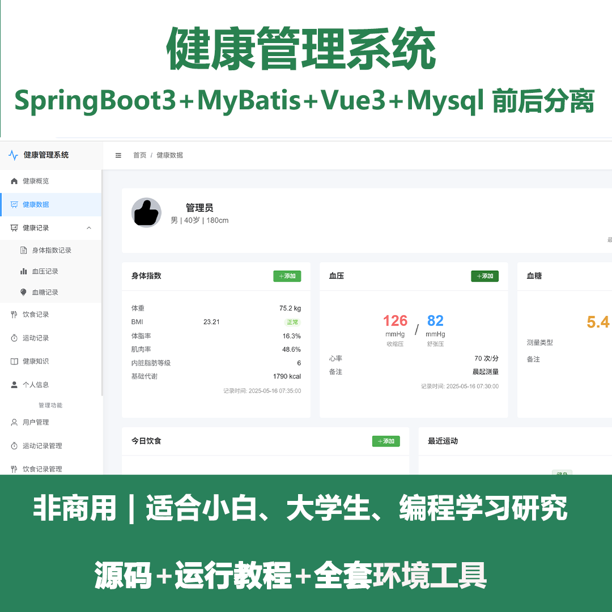
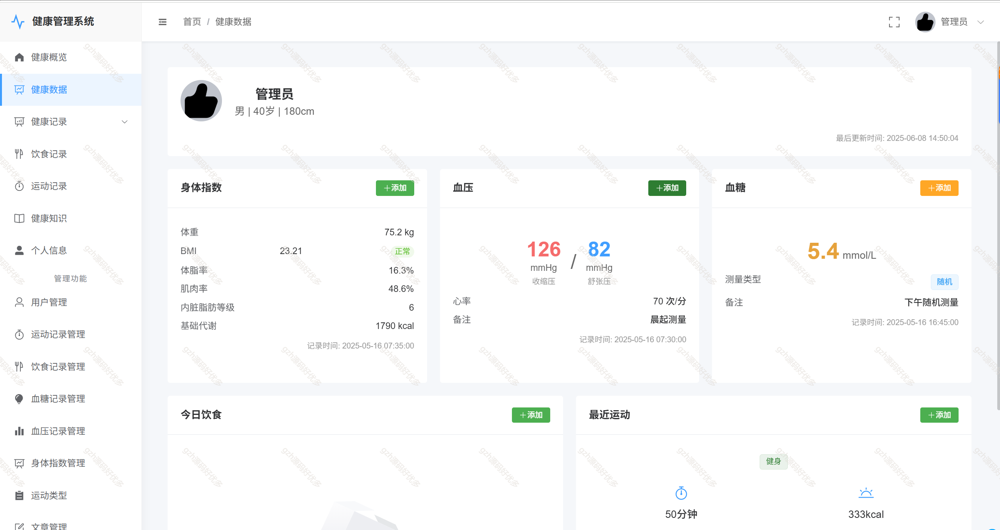
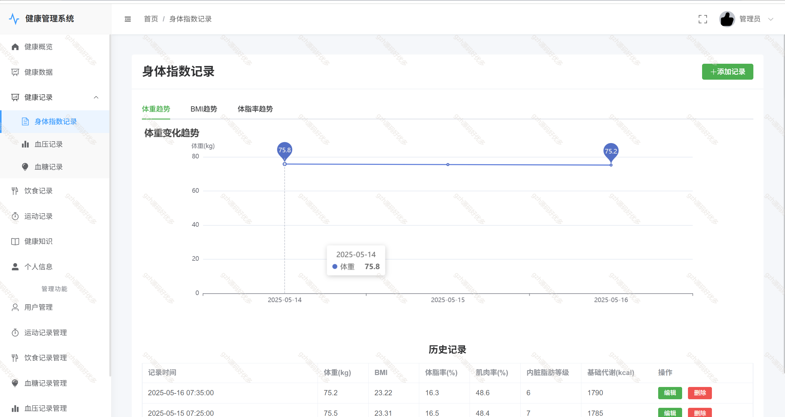
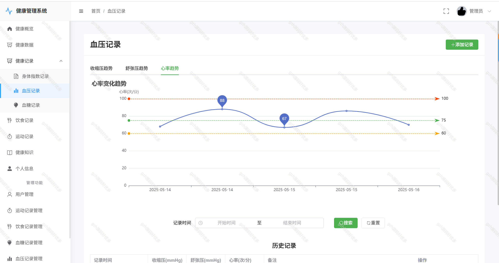
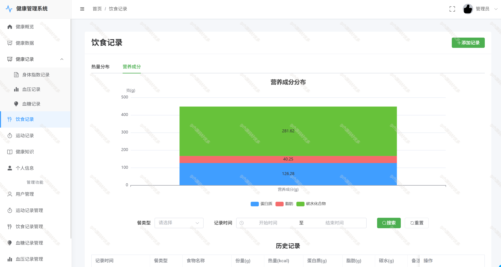
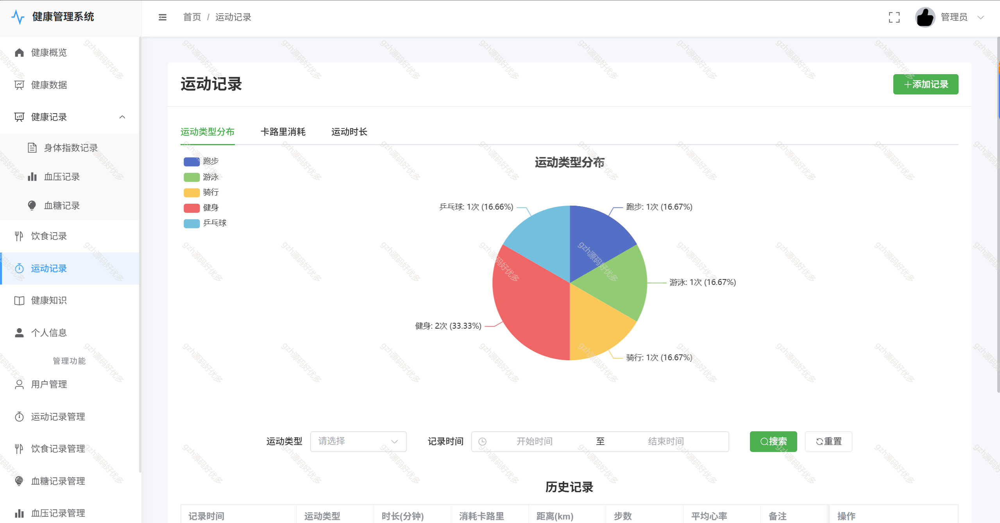
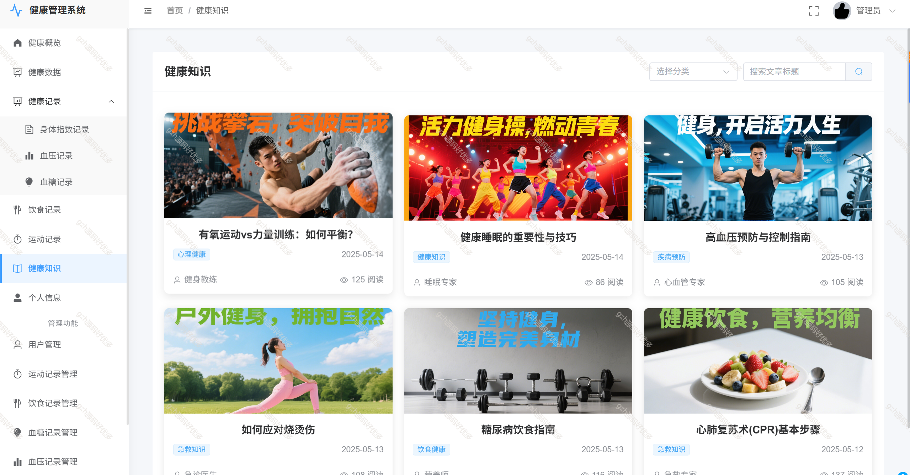
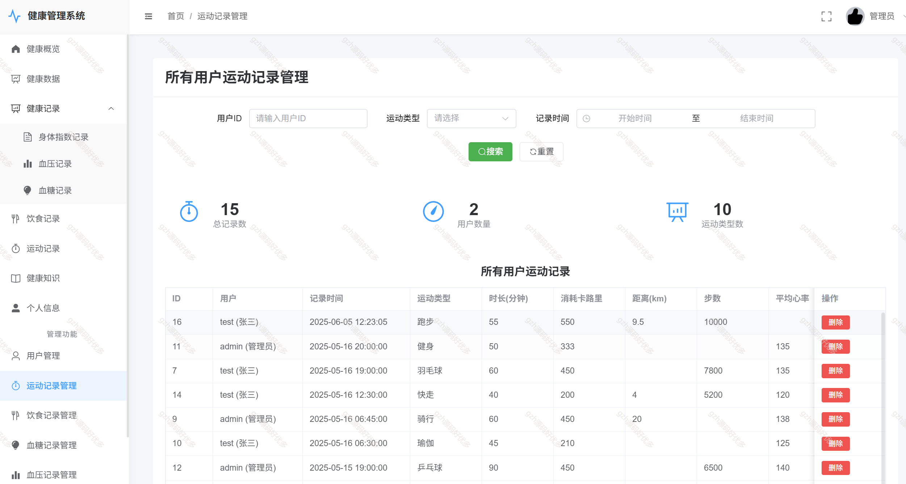
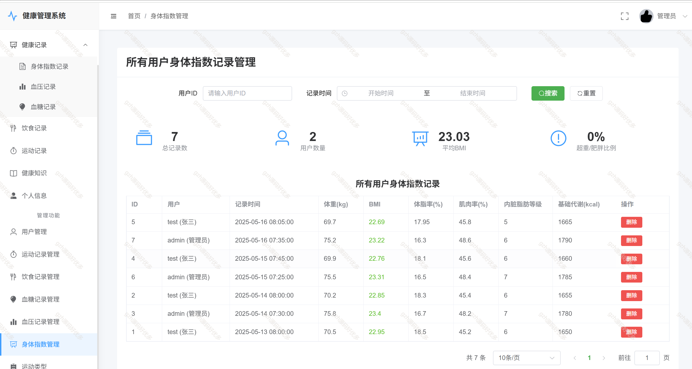

# springbootA376
springbootA376个人健康管理系统
 
## 查看主页获取源码

### 一、关键词

健康管理系统、个人健康系统

 

### 二、作品包含

源码+数据库+全套环境和工具资源+部署教程

 

### 三、项目技术

前端技术： vue3 Element Plus Axios Echarts
后端技术：Java、SpringBoot3.0、MyBatis

  

 

### 四、运行环境（以下版本亲测，其他版本未知，请自测）

开发工具：IDEA/eclipse  + VSCODE

数据库：MySQL8

数据库管理工具：Navicat10以上版本

环境配置软件： JDK1.7 + Maven3.6.3

前端Nodejs：16

浏览器：谷歌浏览器

 

### 五、项目介绍

项目编号：springbootA376

个人健康管理系统是一个基于SpringBoot+Vue的Web应用，旨在帮助用户记录、跟踪和管理个人健康数据，提供健康分析和建议，促进健康生活方式。

3. 功能模块划分
3.1 用户管理模块
        用户注册
        用户登录
        个人信息管理
        密码修改
        权限控制
3.2 健康数据记录模块
        体重管理
        血压记录
        血糖记录
        运动记录
        睡眠记录
饮食记录
3.3 健康分析模块
     健康数据趋势图表

3.4 饮食管理模块

    营养成分分析
    卡路里计算
3.5 运动管理模块

        运动记录与统计
        运动消耗计算

3.6 健康知识模块
    健康资讯

 

### 六、运行截图

